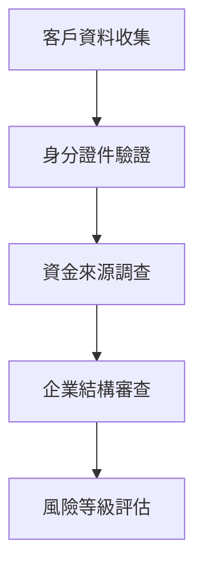

# KYC 認證是什麼？金融與加密貨幣交易的核心驗證機制

## 什麼是KYC認證？
KYC（Know Your Customer）作為現代金融與數位資產領域的關鍵基礎設施，其核心價值在於建立可信的身分驗證體系。這套機制透過系統化審查客戶資訊，有效維護金融系統的完整性與安全性。

### KYC認證的本質與演進
- **核心定義**：金融機構對客戶身份進行驗證與風險評估的標準化流程
- **發展里程碑**：
  - 1998年巴塞爾銀行發布反洗錢聲明奠定基礎
  - 2001年FATF提出40項建議強化國際規範
  - 2010年代數位身分技術推動eKYC革新
  - 2024年台灣金管會發布虛擬資產服務業者登記辦法

### 當代KYC的戰略意義
👉 [立即了解OKX交易所的KYC流程](https://bit.ly/okx_welcome)  
*數字資產領域領先平台如何建立驗證標準*

## KYC認證的三大核心價值
1. **防制金融犯罪**  
   有效阻斷洗錢、詐欺等非法資金流動，全球每年因此避免的經濟損失逾千億美元
2. **強化交易透明度**  
   建立可追溯的交易生態系統，提升市場參與者信心
3. **國際合規門檻**  
   滿足FATF反洗錢標準，避免機構遭受跨境金融制裁

## KYC認證的標準作業流程
完整的KYC機制包含三個關鍵階段：

### 一、基礎客戶審查（CDD）


**企業客戶審查要點**：
- 實質受益人識別（持股25%門檻）
- 供應鏈關係圖譜建立
- 營業項目與實際交易比對

### 二、強化審查機制（EDD）
針對高風險情境的進階驗證：
- 政治公職人員（PEP）交易監控
- 跨境大額資金流動
- 異常交易模式分析（SAR報告）

### 三、持續性監控
建立7x24小時智慧監控系統：
- 交易行為模式分析
- 風險等級動態調整
- 異常活動即時通報

## 各行業應用場景比較

| 行業別        | 典型應用情境                  | 驗證強度 |
|---------------|-----------------------------|----------|
| 傳統金融      | 開戶、貸款、資產管理          | ★★★☆     |
| 加密貨幣      | 交易所註冊、主網轉帳          | ★★★★     |
| 電子支付      | 跨境交易、大額轉帳            | ★★★      |
| 數位銀行      | 無卡ATM提領、遠端理財服務     | ★★★★     |

👉 [探索OKX的全球化KYC解決方案](https://bit.ly/okx_welcome)  
*掌握國際級數位資產平台的驗證標準*

## 加密貨幣領域的KYC實踐

### 臺灣市場現況
根據金管會2024年最新規範：
- 所有虛擬資產服務提供者須完成AML/CFT登記
- 使用者需通過KYC驗證才能進行：
  - 币币交易
  - 法幣出入金
  - 主網資產轉移

### 主流交易所驗證機制比較

#### 币安交易所
| 驗證等級   | 驗證項目                  | 功能開放度               |
|------------|---------------------------|--------------------------|
| 基礎       | 個人資訊+手機驗證         | 日限0.06 BTC交易         |
| 高級       | 政府核發證件+人臉辨識     | 日限100 BTC交易          |
| 企業       | 公司登記證明+受益人審查   | 定製化提現方案           |

#### MAX交易所
```表格
| 驗證階段 | 必備條件                | 解鎖功能                  |
|----------|-------------------------|---------------------------|
| Lv.1     | 電子郵件+手機+身分證     | 數位資產存提+幣幣交易     |
| Lv.2     | 台幣帳戶綁定+地址證明   | 法幣交易+高額提領         |
```

#### Pi Network
**特殊驗證機制**：
- 採用邀請制用戶審查
- 主網轉帳需完成生物特徵驗證
- 社群信任分數影響交易額度

👉 [立即體驗OKX的智慧驗證系統](https://bit.ly/okx_welcome)  
*感受科技賦能的金融安全防護*

## 常見問題解答（FAQ）

**Q：未完成KYC會有哪些限制？**  
A：通常會影響：
- 交易頻率與金額
- 提現功能開放
- 高風險投資商品使用權
- 客戶服務優先等級

**Q：KYC驗證需要多長時間？**  
A：依平台而異：
- 數位銀行：即時自動審核（約5分鐘）
- 加密交易所：人工審核1-3個工作日
- 企業用戶：最高需15個工作天

**Q：如何選擇合規的交易平台？**  
A：觀察三大指標：
1. 是否具備金融監理機構執照
2. KYC流程是否透明規範
3. 資料加密技術是否達國際標準

## 未來發展趨勢
1. **智慧化驗證**：AI人臉辨識準確率達99.9%