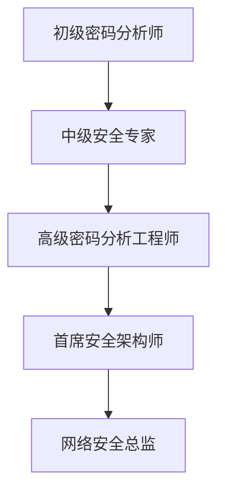

# 密码分析员职业发展指南：薪资与晋升路径全解析

## 什么是密码分析员？

密码分析员是网络安全领域的专业人才，专注于破解加密系统与保护信息安全。这个职业名称源自希腊语*kryptós*（隐藏）和*analýein*（分析），核心职责是**通过解密技术分析隐藏信息**。根据CareerExplorer的研究，这类专业人员需要开发数学方法和加密技术，防止数据被黑客窃取，并在不安全通信渠道中实现安全信息传输。

👉 [掌握加密技术开启高薪职业](https://bit.ly/okx_welcome)

### 核心概念解析
| 术语 | 定义 | 应用场景 |
|------|------|----------|
| 明文 | 可直接阅读的原始数据 | 未加密的邮件/文档 |
| 密文 | 经过加密处理的文本 | 网络传输中的数据包 |
| 哈希算法 | 数据指纹生成技术 | 密码存储与完整性验证 |

**扩展学习**：可通过CISA官方发布的《网络安全术语表》和SANS学院的《安全术语指南》深化专业认知。

## 三大密码技术领域对比

| 领域 | 核心职能 | 技术特征 |
|------|----------|----------|
| 密码学 | 加密算法设计 | 确保数据机密性 |
| 密码分析 | 解密技术研究 | 攻破现有加密系统 |
| 密码术 | 综合研究体系 | 涵盖加密/解密双向技术 |

**职业定位**：密码分析员专注于破解密码体系，与密码学家形成技术攻防互补关系。

## 日常工作职责
1. **安全防护**：设计防止数据被窃取/篡改的加密方案
2. **漏洞分析**：评估现有加密系统的安全性
3. **模型开发**：构建数学模型解决安全问题
4. **技术跟踪**：监控黑客最新攻击手段
5. **工具开发**：编写解密软件与安全测试工具

👉 [获取最新加密技术实战指南](https://bit.ly/okx_welcome)

### 职业发展FAQ
**Q：密码分析员的核心能力是什么？**  
A：需要掌握数论、组合数学等数学基础，精通Python/C++编程，熟悉AES/SHA-256等加密算法，同时具备逆向思维与持续学习能力。

**Q：如何进入该领域？**  
A：建议从网络安全/数学专业起步，考取ECES/CISSP等认证，通过CTF竞赛积累实战经验。

## 教育路径规划
```markdown
1. 基础阶段（本科）
   - 主修方向：数学/计算机科学/网络安全
   - 核心课程：离散数学、密码学原理、网络安全基础

2. 进阶阶段（硕士/博士）
   - 研究方向：量子密码学、后量子密码分析
   - 推荐院校：麻省理工学院、斯坦福大学、加州大学伯克利分校

3. 职业认证
   - ECES（加密专家）
   - CISSP（信息安全专家）
   - CEH（道德黑客）
```

👉 [查看顶尖院校网络安全课程](https://bit.ly/okx_welcome)

## 行业薪资全景图

| 地区 | 平均年薪 | 高薪区间 |
|------|----------|----------|
| 北美 | $112,000 | $150,000+ |
| 欧洲 | €78,000 | €110,000+ |
| 亚洲 | ¥450,000 | ¥800,000+ |
| 中国 | ¥300,000 | ¥600,000+ |

**薪资影响因素**：
- 行业属性（金融/国防/互联网）
- 技术专长（量子加密/区块链安全）
- 项目经验（国家级安全项目）

### 企业招聘趋势
| 企业类型 | 代表企业 | 薪资特点 |
|----------|----------|----------|
| 政府机构 | NSA、中国密码管理局 | 稳定性强，福利完善 |
| 互联网巨头 | Google、腾讯 | 技术前沿，弹性福利 |
| 安全厂商 | Symantec、奇安信 | 项目奖金丰厚 |
| 金融机构 | 摩根大通、招商银行 | 合规要求高 |

## 技能矩阵构建
```markdown
1. 技术硬实力
   - 编程语言：Python、C/C++、Assembly
   - 加密算法：RSA、ECC、AES、SHA系列
   - 工具使用：Wireshark、John the Ripper、IDA Pro

2. 软性竞争力
   - 逆向思维能力
   - 复杂问题拆解
   - 跨部门协作
   - 伦理合规意识
```

## 职业进阶路线


**关键突破点**：
- 参与国家级加密标准制定
- 在IACR等顶级会议发表论文
- 开发行业领先的安全解决方案

### 面试准备指南
**高频考点**：
1. 如何应对量子计算对传统加密的威胁？
2. 请解释侧信道攻击的原理与防御方法
3. 设计一个抗量子加密方案的框架

**实战建议**：
- 参加CTFtime平台的国际竞赛
- 搭建个人漏洞分析实验室
- 研究NIST最新加密标准草案

## 未来发展趋势
1. **量子安全密码学**：应对量子计算威胁
2. **AI辅助分析**：机器学习在密码破解中的应用
3. **区块链安全**：零知识证明技术研究
4. **物联网加密**：轻量级加密算法开发

**行业预测**：
- 2025年全球密码分析市场规模将达$28.6B
- 中国《密码法》实施推动合规需求激增
- 金融/医疗/政务领域加密需求年增长35%

### 常见问题解答
**Q：密码分析与网络安全的关系？**  
A：密码分析是网络安全的技术基础，为数据加密、身份认证、数字签名等核心安全机制提供理论支持。

**Q：零基础如何入门？**  
A：建议从Python编程和密码学基础教材入手，参与在线CTF竞赛，逐步掌握Wireshark等分析工具。

**Q：职业发展瓶颈？**  
A：需持续跟进密码学前沿技术，建议每18个月更新技术栈，重点关注后量子密码学方向。

**Q：远程工作机会？**  
A：约65%的密码分析岗位支持远程办公，但政府/国防项目通常要求现场工作。

**Q：女性从业情况？**  